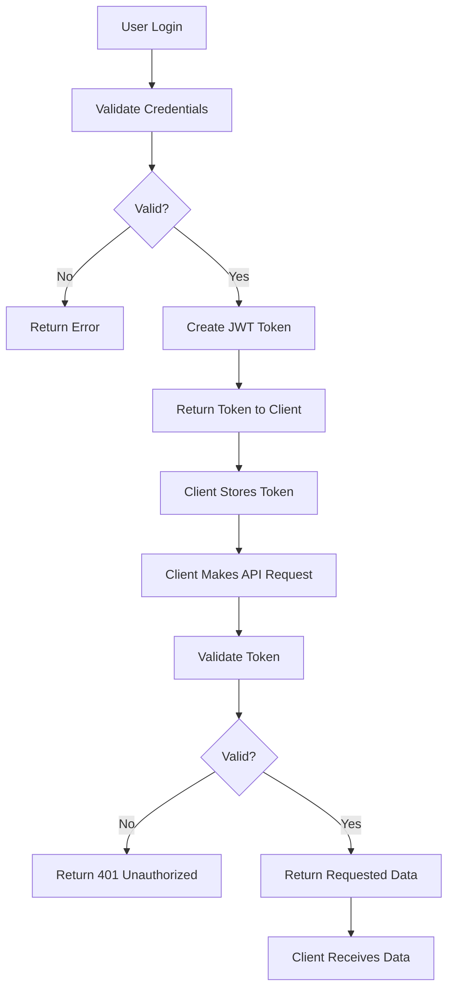

# JWT Authentication Guide

## JWT Flow Diagram



## JWT Components

### Header
```json
{
  "alg": "HS256",
  "typ": "JWT"
}
```

### Payload
```json
{
  "sub": "username",
  "role": "student|teacher|admin",
  "exp": 1234567890
}
```

### Signature
- Uses SECRET_KEY with HS256 algorithm
- Ensures token integrity

## SECRET_KEY Generation

### Linux/Mac
```bash
openssl rand -hex 32
```

### Python
```python
import secrets
print(secrets.token_hex(32))
```

### Recommended Format
```
SECRET_KEY="your-256-bit-secret-key-here-use-openssl-to-generate"
```

## Security Best Practices

### Token Expiry
- `ACCESS_TOKEN_EXPIRE_MINUTES = 30` (30 minutes)
- Refresh tokens available for extended sessions
- Short-lived tokens reduce security risks

### Storage
- Store tokens in HTTP-only cookies
- Use secure, same-site attributes
- Never store in localStorage (XSS vulnerable)

### HTTPS Requirement
- Always use HTTPS in production
- Prevents token interception
- Ensures data encryption

### Token Validation
- Validate token signature
- Check token expiry
- Verify user existence
- Role-based access control

## Token Usage

### Making Authenticated Requests
```javascript
// JavaScript fetch with Authorization header
fetch('/api/tasks', {
  headers: {
    'Authorization': `Bearer ${token}`
  }
})
```

### Token Validation Endpoint
```bash
POST /api/auth/token/validate
Authorization: Bearer <token>
```

### Refresh Token
```bash
POST /api/auth/token/refresh
Authorization: Bearer <token>
```

## Error Handling

### Common Errors
- `401 Unauthorized`: Invalid/expired token
- `400 Bad Request`: Invalid credentials
- `403 Forbidden`: Insufficient permissions

### Security Headers
```python
# FastAPI middleware for security
app.add_middleware(
    CORSMiddleware,
    allow_origins=["https://yourdomain.com"],
    allow_credentials=True,
    allow_methods=["GET", "POST", "PUT", "DELETE"],
    allow_headers=["Authorization", "Content-Type"]
)
```

## Production Considerations

### Environment Variables
```env
# .env file
SECRET_KEY=your-secret-key-here
DATABASE_URL=postgresql://...
NODE_ENV=production
```

### Rate Limiting
- Implement rate limiting on auth endpoints
- Prevent brute force attacks
- Use middleware for protection

### Audit Logging
- Log authentication attempts
- Track user activity
- Monitor for suspicious behavior

## Demo User Registration

```json
{
  "username": "ali",
  "password": "pass123",
  "email": "ali@example.com",
  "role": "student"
}

{
  "username": "sir_ahmed",
  "password": "pass123",
  "email": "sir_ahmed@example.com",
  "role": "teacher"
}

{
  "username": "boss",
  "password": "pass123",
  "email": "boss@example.com",
  "role": "admin"
}
```